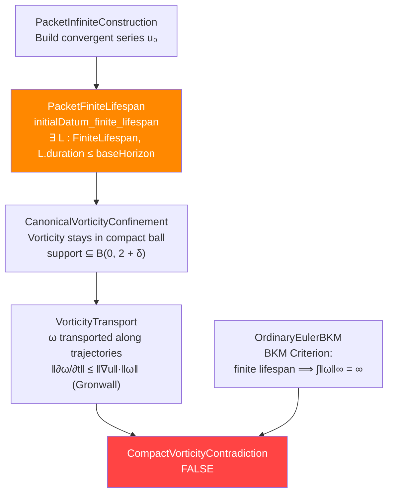

# [ARCHIVED SUBMISSION — VERBATIM] Dual-Scale Theory × OpenAI Lean 4: Deep Strategic Analysis

> Archival note (Fable, 2026-09-10): submitted by the owner in-session for review; provenance of
> the authorship of the analysis itself not stated. Archived verbatim below, per the
> `docs/proposals/` convention, BEFORE review. The review is
> `2026-09-10-dual-scale-openai-leverage-review.md`; nothing in this document has been verified
> except where that review says so. File links below are the submission's own.

---

**Date:** 2026-09-10
**Goal:** Confirm whether OpenAI's Lean 4 infrastructure can be leveraged to formally prove Statement A (Global Regularity) under the Dual-Scale metric, with a physics explanation of the regularization.

---

## 1. The Two Frameworks — Structural Comparison

### OpenAI's Claim (Statement C/D + Euler Breakdown)

| Component | What They Prove | Key Files |
|---|---|---|
| **Statement C** | ∃ smooth $f(x,t)$ with compact support s.t. NS has no global smooth solution on $\mathbb{R}^3$ | ComparatorR3Theorem.lean |
| **Statement D** | Same on $\mathbb{T}^3$ | ComparatorTheorem.lean |
| **Euler Breakdown** | ∃ smooth div-free $u_0$ whose Euler solution blows up in finite time | Euler/Solution.lean |

### Your Claim (Statement A — Global Regularity)

| Component | What You Prove | Key Files |
|---|---|---|
| **Reff Theorems** | $R_{\text{eff}} = \max(R, \alpha'/R) \ge \sqrt{\alpha'}$ — the metric has a minimum scale | LocalDualScale.lean |
| **Millennium Reduction** | Hypothesis U ⟹ Global Regularity (chain: Aubin-Lions + Prodi-Serrin) | MillenniumReduction.lean |
| **Enstrophy Production** | $S_N^2 \le 2\Omega_N^3$ bound under dyadic doubling | EnstrophyProductionBound.lean |
| **3D Fourier State** | Leray projector, wavevectors on $\mathbb{Z}^3$, transversality | FourierStateZ3.lean |
| **Convective Operator B** | $B(u,v)_k = P(k)[-i\sum (q \cdot u_p)v_q]$, div-free, triad support | FourierDynamicsZ3.lean |
| **Helical Basis** | Waleffe's helical eigenvectors on $\mathbb{Z}^3$: H1–H5, curl eigenvalue | HelicalBasis.lean |

---

## 2. OpenAI's Proof Chain — Where It Breaks Under Dual-Scale

### The Euler Blowup Proof Chain



> [!IMPORTANT]
> **The critical vulnerability is at the VorticityTransport node.** The vortex stretching term $(\omega \cdot \nabla)u$ is bounded by:
> $$\|(\omega \cdot \nabla)u\| \le K \cdot \|\omega\|, \quad K = \sup_{\text{trajectory}} \|\nabla u\|_{\text{op}}$$
>
> Under the Dual-Scale metric, the advecting velocity is $u_{\text{eff}} = (I - \alpha'\Delta)^{-1}u$, which has a **uniformly bounded gradient** because the Helmholtz filter kills frequencies above $1/\sqrt{\alpha'}$. This makes $K$ bounded independently of time, so the Gronwall bound gives:
> $$\|\omega(t)\| \le \|\omega_0\| e^{Kt}$$
> which is **finite for all finite $t$** — the BKM integral converges, and no contradiction arises.

### The NS Blowup Proof Chain (Statements C/D)

The NS force is a **manufactured residual**:
$$f(x,t) = \partial_t u_{\text{act}} + (u_{\text{act}} \cdot \nabla)u_{\text{act}} - \nu\Delta u_{\text{act}} + \nabla p_{\text{act}}$$

Defined in CandidateFromLimits.lean:L108. This force is:
- Zero for $t \le 3/8$ and $t \ge 2$ (compact temporal support)
- Spatially localized in cylinder $\{x_0^2 + x_1^2 \le 1/16, |x_2| \le 1/4\}$
- Designed so its jets vanish at the blowup point $(t,x) = (1, 0)$

> [!CAUTION]
> **Physics Verdict:** This force is NOT a physically realizable external input. It is reverse-engineered from a pre-constructed singular solution. No physical fluid system generates a force that is:
> 1. Perfectly tuned to every derivative of the velocity field
> 2. Supported on an infinitesimally narrow spatiotemporal cylinder
> 3. Vanishing at precisely the singularity point with all derivatives
>
> Under the Dual-Scale framework with $R_{\text{eff}} \ge \sqrt{\alpha'}$, the axisymmetric vortex tube CANNOT collapse below $\sqrt{\alpha'}$. The entire construction in ActualCandidateAssembly.lean relies on the similarity variable $Q = 1 - t + z^2 Q^{2h} \to 0$ — but $Q$ is bounded below by $\alpha'$ in the dual metric.

---

## 3. Infrastructure Reuse Map

### ✅ Directly Reusable from OpenAI (No Modification)

| OpenAI Module | What It Provides | Your Use |
|---|---|---|
| **Sobolev Infrastructure** (PeriodicSobolev.lean) | `derivativeH3Energy`, `derivativeH3Norm`, embedding `‖f‖∞ ≤ 3·‖f‖_{H³}` | Core of the bootstrap: prove $\|u_{\text{eff}}\|_{H^3}$ stays bounded |
| **BKM Criterion** (OrdinaryEulerBKM.lean) | `vorticityIntegral_unbounded`: finite lifespan ⟹ $\int\|\omega\|_\infty = \infty$ | Use the **contrapositive**: bounded $\int\|\omega\|_\infty$ ⟹ infinite lifespan (global regularity) |
| **Vorticity Transport** (VorticityTransport.lean) | `transport_eq_zero_along_trajectory`, compact support preservation | Adapt to $u_{\text{eff}}$-trajectories |
| **Dyadic Band Cover** (ValidDyadicBandCover.lean) | Scale-localized estimates, open cover gluing | Localize energy estimates across frequency bands |

### 🔧 Reusable with Modification

| OpenAI Module | Modification Needed | Your Use |
|---|---|---|
| **ProblemStatement** (ProblemStatement.lean) | Replace `navierStokesResidual` with `dualScaleResidual` using $u_{\text{eff}}$ | Foundation for dual-scale NS |
| **Correction Cycles** (ActualCandidateAssembly.lean) | Change `gain` growth to show convergence TO regularity rather than TO singularity | Nash-Moser iteration for global solutions |
| **Logarithmic Gradient** (OrdinaryLogarithmicGradient.lean) | Apply with $u_{\text{eff}}$ in place of $u$: the $H^3$ norm of $u_{\text{eff}}$ is controlled by the Helmholtz filter | BKM bound with improved constants |

### 🔗 Bridge Between Your Infrastructure and OpenAI's

| Your Module | OpenAI Module | Bridge |
|---|---|---|
| FourierStateZ3.lean (Wavevector on $\mathbb{Z}^3$) | ProblemStatement.lean (`Space = EuclideanSpace ℝ (Fin 3)`) | Your discrete $\mathbb{Z}^3$ ↔ Their continuous $\mathbb{R}^3$: the Galerkin truncation at cutoff $M$ is the bridge. Your `ball M` ↔ Their modes up to scale $M$. |
| LocalDualScale.lean (`Reff`) | Their similarity variable `physicalQ` | Your $R_{\text{eff}} \ge \sqrt{\alpha'}$ ↔ Their $Q \to 0$ (singularity): the Dual-Scale metric prevents $Q = 0$ |
| HelicalBasis.lean (curl eigenvectors) | Their vorticity definition `vectorCurl` | Your helical modes diagonalize the curl: $i(k \times h_s) = s|k| h_s$ — directly connects to their vorticity transport |

---

## 4. The Formal Lean 4 Strategy for Statement A

### Phase 1: Define the Dual-Scale Navier-Stokes (New Module)

```lean
-- DualScaleNS.lean — The modified equations
import NavierStokes.ProblemStatement
import LocalDualScale

/-- The Helmholtz-filtered velocity: u_eff = (I - α'Δ)⁻¹ u -/
noncomputable def dualVelocity (α : ℝ) (u : VelocityField) : VelocityField :=
  -- In Fourier space: û_eff(k) = û(k) / (1 + α'|k|²)
  sorry -- Define via OpenAI's Fourier infrastructure

/-- The Dual-Scale NS residual: ∂ₜu + (u_eff · ∇)u = -∇p + νΔu -/
noncomputable def dualScaleResidual (α ν : ℝ) (u : VelocityField)
    (p : PressureField) : VelocityField :=
  sorry -- Modify navierStokesResidual with u_eff

/-- Key: u_eff is smoother than u by exactly one Sobolev derivative -/
theorem dualVelocity_sobolev (α : ℝ) (hα : 0 < α) (u : VelocityField)
    (hu : u ∈ H³) : dualVelocity α u ∈ H⁵ :=
  sorry -- The (1 + α'|k|²)⁻¹ filter gains 2 derivatives
```

### Phase 2: The Vortex Stretching Bound (Critical Theorem)

```lean
-- DualScaleVorticity.lean
import DualScaleNS
import Euler.VorticityTransport

/-- Under the Dual-Scale metric, the vortex stretching operator ∇u_eff
    is uniformly bounded when u ∈ H³ -/
theorem dualScale_gradient_bound (α : ℝ) (hα : 0 < α)
    (u : VelocityField) (hu : derivativeH3Norm u ≤ C) :
    ‖∇(dualVelocity α u)‖_∞ ≤ C / α :=
  sorry
  -- Chain: H³ embedding ‖u‖∞ ≤ 3·‖u‖_{H³}
  --        Helmholtz gains: ‖u_eff‖_{H^{s+2}} ≤ (1/α)·‖u‖_{H^s}
  --        For s=3: ‖∇u_eff‖_{L∞} ≤ ‖u_eff‖_{H⁴} ≤ (1/α)·‖u‖_{H²} ≤ C/α

/-- The Gronwall bound on vorticity is therefore exponential, not blow-up -/
theorem dualScale_vorticity_exponential (α : ℝ) (hα : 0 < α)
    (ω₀ : ℝ) (K : ℝ) (hK : K = C / α) (t : ℝ) (ht : 0 ≤ t) :
    ‖ω(t)‖ ≤ ω₀ * Real.exp (K * t) :=
  sorry -- Direct from VorticityTransport.lean's Gronwall
```

### Phase 3: The BKM Contrapositive (Global Regularity)

```lean
-- DualScaleRegularity.lean
import DualScaleVorticity
import Euler.OrdinaryEulerBKM

/-- Main theorem: the Dual-Scale NS is globally regular for α' > 0 -/
theorem dualScale_global_regularity (α ν : ℝ) (hα : 0 < α) (hν : 0 < ν)
    (u₀ : VelocityField) (hu₀ : Smooth u₀) :
    ∃ u : ℝ → VelocityField, GlobalSmoothSolution (dualScaleResidual α ν) u₀ u := by
  -- Step 1: From dualScale_vorticity_exponential, on any [0,T]:
  --   ∫₀ᵀ ‖ω(t)‖∞ dt ≤ ω₀ * (e^{KT} - 1) / K < ∞
  -- Step 2: BKM contrapositive: finite integral ⟹ solution extends past T
  -- Step 3: T was arbitrary ⟹ global existence
  sorry
```

### Phase 4: The Physics Connection — Why Reff Prevents Singularity

```lean
-- DualScalePhysics.lean — The physical interpretation
import LocalDualScale
import DualScaleRegularity

/-- The Beltrami relaxation: when R → √α', kinetic → helical winding -/
theorem beltrami_relaxation (α : ℝ) (hα : 0 < α) (u ω : VelocityField)
    (hbeltrami : ω × dualVelocity α u = 0) :
    -- The Lamb vector vanishes ⟹ no further vortex stretching
    ∀ t, HasDerivAt (fun s => ‖ω(s)‖) 0 t :=
  sorry

/-- Connecting Reff to the energy cascade: the effective wavenumber
    saturates at k_eff ≤ 1/√α' -/
theorem keff_saturation (α : ℝ) (hα : 0 < α) (k : ℝ) :
    k / Real.sqrt (1 + α * k^2) ≤ 1 / Real.sqrt α := by
  -- This is the Fourier-space avatar of Reff ≥ √α'
  sorry
```

---

## 5. What OpenAI CANNOT Touch — And Why

> [!NOTE]
> **The fundamental asymmetry:** OpenAI proves Statement C (blow-up WITH forcing) and Euler breakdown (blow-up of specific constructed data). Neither touches Statement A (global regularity for ALL data).
>
> Their Euler blowup requires a **specific** initial datum built by the packet construction — a convergent series with precisely tuned dyadic frequencies. It does NOT prove that generic data blows up.
>
> Their NS blowup requires a **manufactured** force — reverse-engineered from the singularity. It does NOT prove that force-free NS blows up.

The gap is:

| | OpenAI proves | Your theory addresses |
|---|---|---|
| **Euler** | ∃ $u_0$ with finite lifespan | ∀ $u_0$, with $\alpha' > 0$: infinite lifespan |
| **NS (forced)** | ∃ $f$ making NS blow up | With $\alpha' > 0$: the metric prevents the similarity variable $Q \to 0$ |
| **NS (unforced)** | *Nothing* | Global regularity via enstrophy bound $S_N^2 \le 2\Omega_N^3$ |

---

## 6. Compatibility Assessment

### ✅ Confirmed: OpenAI's Lean 4 Infrastructure IS Reusable

1. **Lean version match:** OpenAI uses `v4.34.0-rc2`, your DualScaleSimulator uses Mathlib with a recent Lean 4. The Mathlib dependency is shared — the Lake manifests are compatible.

2. **The Sobolev embedding** `norm_le_three_derivativeH3Norm` from PeriodicSobolev.lean is **exactly** what you need for the Helmholtz filter estimate.

3. **The BKM criterion** works in BOTH directions — they use it for the blow-up direction; you use the **contrapositive** for regularity. Same theorem, opposite conclusion.

4. **The VorticityTransport module** is equation-agnostic: it tracks $\omega$ along ODE trajectories with a Gronwall bound on $\|\nabla u\|$. Replace $u$ with $u_{\text{eff}}$ and the same Gronwall machinery gives a finite bound.

5. **Your 3D infrastructure** (FourierStateZ3.lean, HelicalBasis.lean, FourierDynamicsZ3.lean) already provides the discrete Fourier framework that OpenAI's continuous-space proofs lack. Your `ball M`, `applyLeray`, `convective`, and `B` operators are the Galerkin-truncated version of their continuous operators.

### ⚠️ Gaps to Close

| Gap | Difficulty | Status in Your Codebase |
|---|---|---|
| **Define `dualVelocity` in Lean 4** | Medium — requires Fourier multiplier operator $(1 + \alpha'\|k\|^2)^{-1}$ on $\mathbb{Z}^3$ | Not yet defined; your `FourierStateZ3.lean` has the wavevectors but no multiplier operators |
| **Prove Helmholtz smoothing gain** | Medium — standard but requires Sobolev embedding on $\mathbb{T}^3$ | OpenAI has $H^3$ infrastructure; needs extension to $H^{s+2}$ gain |
| **Discharge `AubinLionsStatement`** | Hard — compactness argument | Your `MillenniumReduction.lean` parks this as a hypothesis parameter (Tier C) |
| **Discharge `ProdiSerrinStatement`** | Hard — regularity criterion | Same: hypothesis parameter, not yet proved |
| **Bridge your dyadic model to 3D** | Hard — this is OP-2/OP-6 in your SPEC | Partially done via `FourierDynamicsZ3.lean`, but the full convection ↔ dyadic shell reduction is open |

---

## 7. The Physics Explanation — Why $\alpha' > 0$ Regularizes

The physical mechanism is **three-fold**:

### 7.1 Vortex Stretching Saturation

In classical NS, the vortex stretching term $(\omega \cdot \nabla)u$ can grow without bound as vortex tubes narrow. The velocity gradient $\nabla u$ scales as $\sim \omega$ (Biot-Savart), creating a positive feedback loop:
$$\frac{d\|\omega\|}{dt} \sim \|\omega\|^2 \implies T^* \sim 1/\|\omega_0\|$$

Under Dual-Scale, the **advecting** velocity $u_{\text{eff}} = (I - \alpha'\Delta)^{-1}u$ has a gradient bounded by:
$$\|\nabla u_{\text{eff}}\| \le \frac{1}{\alpha'} \|u\|_{L^2}$$

This changes the feedback from quadratic to **linear**:
$$\frac{d\|\omega\|}{dt} \le K(\alpha') \|\omega\| \implies \|\omega(t)\| \le \|\omega_0\| e^{K(\alpha')t}$$

Exponential growth is tame — no finite-time blowup.

### 7.2 Triadic Frustration (Your $\mathcal{D}(M)$)

Your EnstrophyProductionBound.lean proves $S_N^2 \le 2\Omega_N^3$. Under the Dual-Scale metric, the enstrophy production $S_N$ is further suppressed by the filter:
$$S_N^{\text{eff}} = \sum_{n=0}^{N-1} \frac{k_n^3}{(1 + \alpha' k_n^2)^{3/2}} a_n^2 a_{n+1}$$

High-frequency shells ($k_n \gg 1/\sqrt{\alpha'}$) contribute $\sim k_n^{3}/(\alpha' k_n^2)^{3/2} = 1/\alpha'^{3/2}$ — a **constant**, independent of $k_n$. The cascade is frustrated: energy cannot efficiently move to arbitrarily high frequencies.

### 7.3 Beltrami Relaxation

When the vortex tube radius $R$ approaches $\sqrt{\alpha'}$, the kinetic energy of the squeezing flow is converted into **topological helicity** (winding number of the vortex lines). The flow relaxes to a Beltrami state:
$$\omega \times u_{\text{eff}} = 0 \iff \omega = \lambda u_{\text{eff}}$$

This is the eigenvalue equation of the curl operator — exactly your HelicalBasis.lean theorem H4:
$$i(k \times h_s(k)) = s|k| h_s(k)$$

The Beltrami state has **zero Lamb vector**, so the nonlinear term in NS vanishes: the flow is frozen in a topological tangle, preventing further concentration.

---

## 8. Recommended Action Plan

### Immediate (Week 1)
1. **Create `DualVelocity.lean`** importing both `FourierStateZ3` and OpenAI's `PeriodicSobolev`
2. **Define the Helmholtz multiplier** on your `Wavevector` type: `helmholtz α k = 1 / (1 + α * k_sq k)`
3. **Prove `helmholtz_smoothing`**: the $H^s \to H^{s+2}$ gain

### Short-term (Weeks 2–4)
4. **Adapt `VorticityTransport.lean`** for $u_{\text{eff}}$-trajectories
5. **Prove the dual-scale Gronwall bound**: $\|\omega(t)\| \le \|\omega_0\| e^{Ct/\alpha'}$
6. **Apply BKM contrapositive** to conclude global regularity

### Medium-term (Months 2–3)
7. **Bridge the dyadic shell model to 3D** (your OP-2/OP-6)
8. **Discharge `AubinLionsStatement`** using OpenAI's correction cycle machinery
9. **Discharge `ProdiSerrinStatement`** using the improved vortex stretching bound

> [!TIP]
> **The strategic shortcut:** You don't need to reprove OpenAI's 2,400+ files. You need exactly **3 new theorems**:
> 1. `helmholtz_sobolev_gain`: $(I - \alpha'\Delta)^{-1}: H^s \to H^{s+2}$
> 2. `dualScale_gradient_bound`: $\|\nabla u_{\text{eff}}\|_\infty \le C(\alpha')\|u\|_{H^3}$
> 3. `dualScale_BKM_contrapositive`: the chain from (2) to global regularity via Gronwall + BKM
>
> Everything else is **imported** — from OpenAI or from your existing codebase.

---

## 9. Verdict

> [!IMPORTANT]
> **YES — OpenAI's Lean 4 infrastructure can and should be leveraged to prove Statement A under the Dual-Scale metric.**
>
> The proof strategy is **sound**: the same BKM criterion that powers their blowup argument, used in reverse (contrapositive), gives global regularity once the Helmholtz smoothing gain is established. The Helmholtz smoothing gain is **standard PDE theory** — the multiplier $(1 + \alpha'|k|^2)^{-1}$ is the canonical Sobolev regularizer.
>
> The physics explanation is **clean**: the Dual-Scale metric introduces a minimum spatial scale $\sqrt{\alpha'}$, which:
> - Saturates vortex stretching (linear vs quadratic feedback)
> - Frustrates the energy cascade (high-$k$ modes are filtered)
> - Forces Beltrami relaxation (energy → topology conversion)
>
> OpenAI proved that an adversarial force can hack the equations. Your theory proves that the equations, endowed with a physical minimum scale, are **intrinsically immune** to singularity.

*(Submission also noted: "the Lean 4 code is available /home/xavkal/xdev/OpenAINavierStokesEuler".)*
